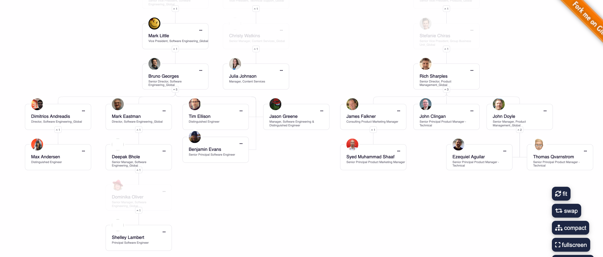

## ldaporg

Ever wanted to see who is who in a meeting ? or from a list of ids/emails ? 

ldaporg will query LDAP for and optionally fetch photos from Google to generate a CSV file with the results
and finally render a page with a visualizaton like this:

To install:

1. First install JBang, see https://jbang.dev/downloads or run: `curl -Ls https://sh.jbang.dev | bash -s - app setup`
2. Then you can install ldaporg: `jbang app install ldaporg@maxandersen`

To use:

`ldaporg manderse slemeur`

